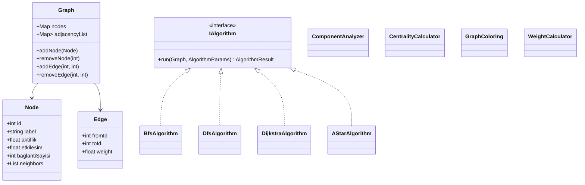
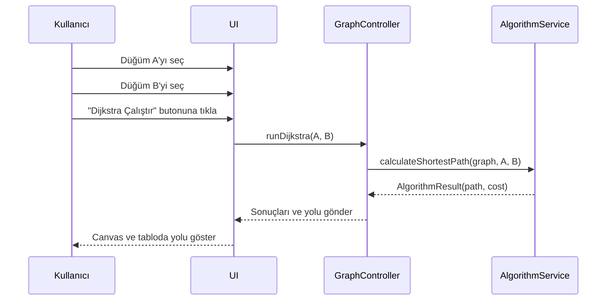

# 📄 Teknik Tasarım Dokümanı (TDD)

## Sosyal Ağ Analizi Uygulaması

### 1. Giriş

Bu dokümanın amacı, geliştirilen **Sosyal Ağ Analizi Uygulaması**nın teknik tasarımını ayrıntılı şekilde tanımlamaktır. Uygulama; kullanıcılar (düğümler) ve aralarındaki ilişkileri (bağlantılar) bir **graf veri yapısı** ile modelleyerek, çeşitli algoritmaları (BFS, DFS, Dijkstra, A*, bağlı bileşenler, merkezilik, Welsh–Powell renklendirme) çalıştıran ve sonuçları görselleştiren bir sistemdir. 

Doküman; mimari yapı, sınıf tasarımı, veri modeli, algoritma tasarımı, kullanıcı arayüzü, veri saklama ve performans gereksinimleri ile test ve olası geliştirmeleri kapsamaktadır.

---

### 2. Sistem Genel Tanımı

#### 2.1. Ana İşlevler

* Kullanıcı (düğüm) ekleme, silme, güncelleme
* Bağlantı (kenar) ekleme, silme
* Düğümlerin özelliklerinin (aktiflik, etkileşim, bağlantı sayısı vb.) yönetilmesi
* Grafın canvas üzerinde görsel olarak gösterilmesi
* BFS, DFS, Dijkstra, A* gibi algoritmaların ayrı ayrı tetiklenmesi
* Bağlı bileşenlerin ve toplulukların çıkarılması
* Derece merkeziliğine göre en etkili kullanıcıların bulunması
* Welsh–Powell ile graf renklendirme
* CSV/JSON ile veri içe ve dışa aktarma (komşuluk listesi/matrisi) 

#### 2.2. Kullanım Senaryoları (Özet)

1. **Kullanıcı Graf Oluşturur:**

   * Yeni düğüm ekler, düğümler arası bağlantılar kurar.
2. **Algoritma Çalıştırma:**

   * Bir düğüm seçer, BFS/DFS ile erişilebilir kullanıcıları listeler.
   * İki düğüm seçer, Dijkstra veya A* ile en kısa yolu bulur.
3. **Analiz & Görselleştirme:**

   * Toplulukları, renklendirmeyi ve merkezilik tablosunu görür.
4. **Veri Saklama:**

   * Mevcut grafı CSV/JSON formatında kaydeder, daha sonra geri yükler.

---

### 3. Mimari Tasarım

#### 3.1. Katmanlar

Uygulama dört temel katmandan oluşur:

1. **Sunum Katmanı (UI Layer)**

   * Canvas üzerinde graf çizimi
   * Butonlar, form alanları, algoritma seçimleri
   * Kullanıcı etkileşimleri (tıklama, seçim, sürükleme vb.)

2. **Uygulama / Controller Katmanı**

   * UI’dan gelen istekleri işleyip ilgili servisleri çağırır.
   * Grafın güncellenmesi, algoritmaların tetiklenmesi, sonuçların UI’a iletilmesi.

3. **Domain Katmanı (Çekirdek Mantık)**

   * `Node`, `Edge`, `Graph`, `Algorithm` arayüzü
   * BFS/DFS, Dijkstra, A*, Component Analyzer, Centrality, Coloring gibi sınıflar
   * Ağırlık hesaplayıcı (WeightCalculator)

4. **Altyapı Katmanı (Infrastructure)**

   * CSV/JSON okuma/yazma
   * Dosya yolu yönetimi, hata yönetimi
   * Performans ölçümleri ve loglama

#### 3.2. Yüksek Seviyeli Mimari Diyagram (Mermaid)

```mermaid
flowchart LR
    UI[Sunum Katmanı\n(Canvas, Paneller)]
    CTRL[GraphController\n& AlgorithmController]
    DOMAIN[Domain Katmanı\n(Graph, Algorithms)]
    INFRA[Infrastructure\n(CSV/JSON IO, Metrics)]

    UI --> CTRL
    CTRL --> DOMAIN
    CTRL --> INFRA
    DOMAIN --> INFRA
```

---

### 4. Sınıf Tasarımı

#### 4.1. Temel Domain Sınıfları

* **Node**

  * Özellikler:

    * `id: int`
    * `label: string`
    * `aktiflik: float`
    * `etkilesim: float`
    * `baglantiSayisi: int`
    * `neighbors: List<Node>` veya `neighborIds: List<int>`

* **Edge**

  * `fromNode: Node`
  * `toNode: Node`
  * `weight: float`
  * `isDirected: bool` (proje gereği yönsüz, ama alan bulunabilir)

* **Graph**

  * `nodes: Map<int, Node>`
  * `adjacencyList: Map<int, List<Edge>>`
  * Metotlar: `addNode`, `removeNode`, `updateNode`, `addEdge`, `removeEdge`, `getNeighbors`, `getNodeById` vb.

* **IAlgorithm (Arayüz)**

  * `run(graph: Graph, params: AlgorithmParams): AlgorithmResult`

* **PathFindingAlgorithm (Soyut Sınıf)**

  * `implements IAlgorithm`
  * Ortak metotlar: mesafe dizileri, öncül (previous) düğüm dizisi vb.

* **BfsAlgorithm, DfsAlgorithm, DijkstraAlgorithm, AStarAlgorithm**

  * Her biri `IAlgorithm` arayüzünü uygular.

* **ComponentAnalyzer**

  * Bağlı bileşenleri bulur.

* **CentralityCalculator**

  * Derece merkeziliği ve en yüksek dereceli 5 düğümü hesaplar.

* **GraphColoring (WelshPowellAlgorithm)**

  * Welsh–Powell renklendirme algoritmasını uygular.

* **WeightCalculator**

  * İki düğüm arasındaki ağırlığı dinamik formüle göre hesaplar (4.3’te verilen formül).

Örnek sınıf diyagramı (Mermaid ile):



---

### 5. Veri Modeli ve Ağırlık Hesaplama

#### 5.1. Düğümlerin CSV Formatı

Düğümler, aşağıdaki alanlardan oluşan bir CSV dosyasında saklanır: 

| Sütun Adı     | Açıklama                              |
| ------------- | ------------------------------------- |
| `DugumId`     | Benzersiz düğüm kimliği               |
| `Ozellik_I (Aktiflik)`   | Aktiflik (0–1 arası float)            |
| `Ozellik_II (Etkilesim)` | Etkileşim sayısı veya skoru           |
| `Ozellik_III (Bagl. Sayisi)` | Bağlantı sayısı                       |
| `Komsular`    | Virgülle ayrılmış komşu düğüm Id’leri |

Örnek:

```text
DugumId,Ozellik_I (Aktiflik),Ozellik_II (Etkilesim),Ozellik_III (Bagl. Sayisi),Komsular
1,0.8,12,3,"2,4,5"
2,0.4,5,2,"1,3"
```

#### 5.2. Ağırlık Hesaplama Formülü

İki düğüm arasındaki ağırlık (maliyet) şu formülle hesaplanır: 

[
Agirlik_{i,j} = \frac{1}{1 + \sqrt{(Aktiflik_i - Aktiflik_j)^2 
+ (Etkilesim_i - Etkilesim_j)^2 
+ (Baglanti_i - Baglanti_j)^2}}

]

* Benzer özelliklere sahip düğümler için uzaklık küçük, ağırlık büyük olur.
* Farklar arttıkça ağırlık azalır.
* `WeightCalculator` sınıfı bu hesabı kapsüller; tüm algoritmalar kenar maliyeti olarak bu değeri kullanır.
* Komsular sutunu otomatik kenar olusturmak icin kullanilir.

---

### 6. Algoritma Tasarımı

Her algoritma, `IAlgorithm` arayüzünü uygular ve `AlgorithmResult` nesnesi döner. `AlgorithmResult` içinde örneğin:

* `visitedOrder: List<int>`
* `path: List<int>` (yol gerektirenler için)
* `cost: float`
* `components: List<List<int>>` gibi alanlar bulunur.

#### 6.1. BFS ve DFS

* **Girdi:** Başlangıç düğüm Id’si
* **Çıktı:** Erişilebilen düğüm listesi, ziyaret sırası
* **Amaç:** Bir düğümden erişilebilen tüm kullanıcıları bulma
* **Karmaşıklık:** O(V + E)

#### 6.2. Dijkstra Algoritması

* **Girdi:** Başlangıç ve hedef düğüm Id’leri
* **Çıktı:** En kısa yol üzerindeki düğümler ve toplam maliyet
* **Kullanılan Maliyet:** `WeightCalculator` ile hesaplanan ağırlıklar
* **Karmaşıklık:** O((V+E) log V) (öncelikli kuyruk ile)

#### 6.3. A* Algoritması

* Dijkstra’ya benzer, ek olarak `heuristic(node)` fonksiyonu kullanır.
* Heuristik örneği: Özellikler arasındaki farklara dayalı yaklaşık uzaklık (ör: sadece aktiflik farkına göre).
* **Amaç:** İki düğüm arasındaki en kısa yolu Dijkstra’dan daha hızlı bulmak.

#### 6.4. Bağlı Bileşenler

* Graf yönsüz kabul edilerek BFS/DFS ile tüm bileşenler bulunur.
* Her bileşen bir liste olarak saklanır: `List<List<int>>`.

#### 6.5. Merkezilik (Degree Centrality)

* Her düğüm için derece: `deg(v) = neighbors(v).length`
* Tüm düğümlerin dereceleri hesaplanır, azalan sırada sıralanır.
* En yüksek dereceli ilk 5 düğüm tablo halinde UI’da gösterilir.

#### 6.6. Welsh–Powell Graf Renklendirme

* Düğümler dereceye göre sıralanır.
* Sırayla dolaşılıp komşuları aynı rengi almayacak şekilde renk atanır.
* Her renk ayrı bir “topluluk” gibi görselleştirilebilir.

---

### 7. Kullanıcı Arayüzü Tasarımı

#### 7.1. Ana Ekran

* **Sol taraf:** Canvas üzerinde graf (düğümler ve kenarlar)
* **Sağ/alt panel:**

  * Düğüm detayları (seçili düğümün özellikleri)
  * Algoritma seçimi (BFS, DFS, Dijkstra, A*, Topluluk, Merkezilik, Renklendirme)
  * Sonuç tabloları (yol, merkezilik listesi, bileşenler, renk tablosu)
* **Üst menü / toolbar:**

  * “Düğüm Ekle”, “Bağlantı Ekle”, “Sil”, “Kaydet (CSV/JSON)”, “Yükle” butonları

#### 7.2. Etkileşim Akışı (Örnek)



---

### 8. Veri Saklama ve Yükleme

* **Formatlar:**

  * Düğümler için CSV (yukarıda tanımlanan yapı)
  * Alternatif olarak JSON ile hem düğümler hem kenarlar birlikte saklanabilir. 

* **GraphLoader**

  * CSV/JSON dosyasını okur, `Graph` nesnesini oluşturur.
  * Hatalı satırlar için uyarı üretir.

* **GraphSaver**

  * Mevcut `Graph` durumunu CSV/JSON formatında diske yazar.
  * Komşuluk listesi veya matrisi çıktısı üretir.

---

### 9. Hata Yönetimi

* Aynı Id’ye sahip düğüm tekrar eklenmek istendiğinde hata/uyarı
* Self-loop (düğümün kendine bağlanması) engellenir
* Var olmayan düğümler için kenar eklenmesi engellenir
* Dosya okuma/yazmada:

  * Eksik sütun, yanlış tip gibi durumlarda kullanıcıya anlamlı hata mesajı

Bu gereksinimler proje dokümanındaki “hatalı veri uygun şekilde engellenmelidir” şartını karşılar. 

---

### 10. Performans ve Test

* **Küçük Ölçekli Graf:** 10–20 düğüm
* **Orta Ölçekli Graf:** 50–100 düğüm

Her algoritma için şu bilgiler toplanır:

* Çalışma süresi (ms cinsinden)
* Ziyaret edilen düğüm sayısı
* Bulunan yol uzunluğu (varsa)

Bu bilgiler, raporda tablo halinde gösterilir ve ekran görüntüleri ile desteklenir.

---

### 11. Olası Geliştirmeler

* Farklı merkezilik türleri (betweenness, closeness vb.)
* Yönlü graf desteği
* Farklı renklendirme algoritmaları
* Büyük ölçekli graflar için (1000+ düğüm) performans optimizasyonları
* Farklı görselleştirme layout’ları (force-directed, circle, grid vb.)

---

